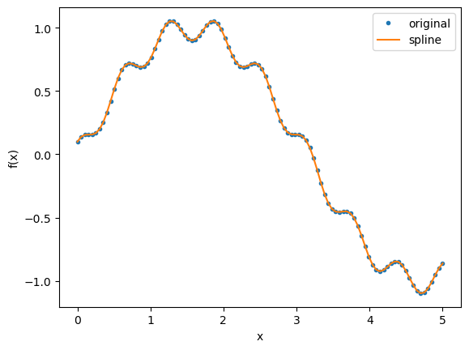
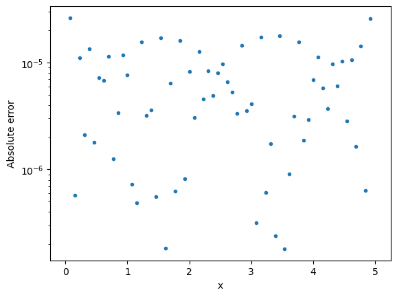
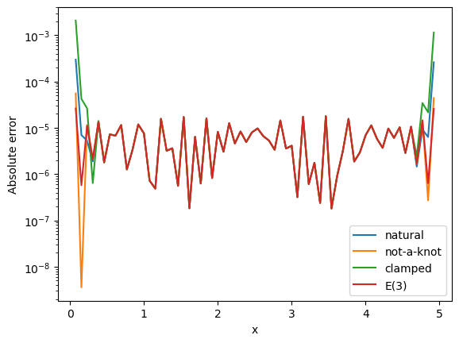
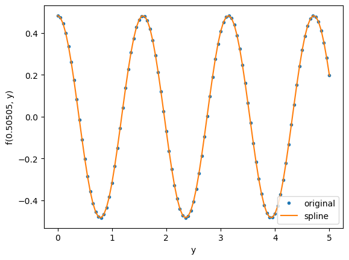
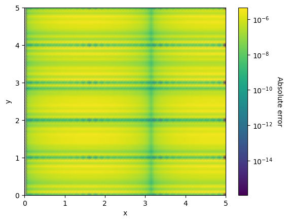
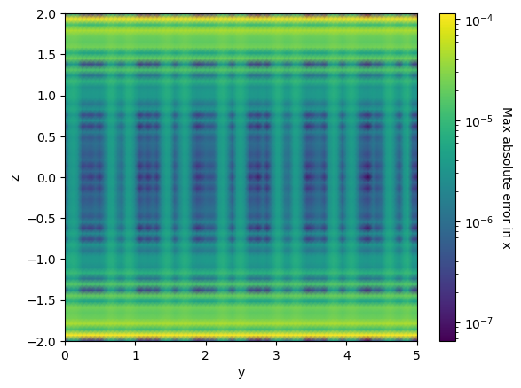

# multispline
A Python package for generating cubic splines in one, two, or three (hence, multiple) dimensions. The package
supports a number of boundary conditions, but is restricted to interpolating data that is spaced on a uniform
grid. Documentation and useful examples are provided in the Jupyter notebook `tutorial.ipynb`. Minimal working
examples are also provided below.

# Installation

We recommend installing `multispline` through the package installer `pip`, but we also provide instructions
for installing from source.

## Using pip

The easiest way to install `multispline` is through `pip`
```
python3 -m pip install multispline
```

## From source

`multispline` relies on a few dependencies to install and run, namely
a C/C++ compiler (e.g., `g++`), `Cython`, `numpy`, and `python >= 3.7`, though we recommend using at least Python 3.9.
To reduce package conflicts and ensure that the proper dependencies are installed,
we recommend using `conda` and its virtual environments, which can be obtained through the [Miniforge distribution](https://github.com/conda-forge/miniforge).

Create a conda environment `spline-env` (or whatever name you would like)
with the necessary dependencies to install `multispline`. For MACOSX Intel run:
```
conda create -n spline-env -c conda-forge Cython numpy clang_osx-64 clangxx_osx-64 python=3.9
conda activate spline-env
```
This may also work for MACOSX silicon, though alternatively one should use:
```
conda create -n spline-env -c conda-forge Cython numpy clang_osx-arm64 clangxx_osx-arm64 python=3.9
conda activate spline-env
```
See Troubleshooting.
To instead include the necessary compiler on linux run:
```
conda create -n spline-env -c conda-forge Cython numpy gcc_linux-64 gxx_linux-64 python=3.9
conda activate spline-env
```
Next clone the :code:`multispline` repository from GitHub:
```
git clone https://github.com/znasipak/multspline.git
cd multispline
```
Finally, we recommend installing the package via `pip`:
```
pip install .
```

# Conda Environments with Jupyter

To run the code in a jupyter notebook, we recommend installing
the following dependencies through your preferred package manager,
such as `conda`: 
```
conda install ipykernel matplotlib
```
One can then make the environment accessible within Jupyter by
running
```
python -m ipykernel install --user --name=multispline-env
```

# Tutorial

Import basic packages


```python
import numpy as np
import matplotlib.pyplot as plt
```

## Cubic Spline (1D)

The class `CubicSpline` provides a method for interpolating data sampled on a uniform one-dimensional grid.


```python
from multispline.spline import CubicSpline
```

As a first example we interpolate an oscillatory function, sampled at 100 equidistant points, using `CubicSpline`


```python
def test_function(x):
    return np.sin(x) + 0.1 * np.cos(10*x)

sample_points = np.linspace(0, 5, 100)
sample_values = test_function(sample_points)
```

Constructing an interpolating cubic spline is then as simple as initializing the `CubicSpline` class


```python
cspl = CubicSpline(sample_points, sample_values)
```

We can evaluate the spline to visually check how well the spline approximates our test function


```python
plt.plot(sample_points, sample_values, '.', label='original')
plt.plot(sample_points, cspl(sample_points), label='spline')
plt.legend()
plt.xlabel('x')
plt.ylabel('f(x)')
plt.show()
```


    

    


To test the accuracy of the spline, we can also evaluate it at values that differ from the sample values


```python
test_points = np.linspace(0, 5, 66)
test_values = test_function(test_points)
```


```python
plt.plot(test_points, np.abs(test_values - cspl(test_points)), '.')
# plt.legend()
plt.xlabel('x')
plt.yscale('log')
plt.ylabel('Absolute error')
plt.show()
```


    

    


Cubic splines are not fully constrained by the sample data, but require a choice of boundary conditions. We can check the different types of boundary conditions offered by `multispline` by calling `available_boundary_conditions()`


```python
from multispline.spline import available_boundary_conditions
available_boundary_conditions()
```


    ['natural', 'not-a-knot', 'clamped', 'E(3)']


The default choice is known as the "E(3)" boundary condition. Other boundary conditions may be specified using the optional `bc` argument when instantiating `CubicSpline`


```python
cspl_natural = CubicSpline(sample_points, sample_values, bc='natural')
```

Notice that this new spline will not exactly agree with the original spline


```python
print(cspl_natural(0.001) - cspl(0.001))
```

    -0.00014990567110854947


Different boundary conditions may be better at approximating the behavior of the test function near the boundary. However, which boundary condition works best depends on the problem and the number of sample points. Below, we demonstrate how the "E(3)" boundary condition most accurately approximates the test function near the boundary, though the "not-a-knot" algorithm provides similarly well and more accurately approximates the test function at some points near the boundary.


```python
cspl_bcs = {}
for bc in available_boundary_conditions():
    cspl_bcs[bc] = CubicSpline(sample_points, sample_values, bc=bc)

for bc in available_boundary_conditions():
    plt.plot(test_points[1:-1], np.abs(cspl_bcs[bc](test_points[1:-1]) - test_function(test_points[1:-1])), label=bc)
plt.legend()
plt.yscale('log')
plt.xlabel('x')
plt.ylabel('Absolute error')
plt.show()
```


    

    


We can also evaluate the first and second derivatives of the spline through the methods `deriv` and `deriv2`


```python
print(cspl.deriv(0.4325))
print(cspl.deriv2(0.4325))
```

    1.8338073517167228
    3.3129057480026125


And we can directly access the spline coefficients through the class property `coefficients`---which returns a full array of coefficients---or the method `coeff` which returns a single coefficient for a given interval and polynomial power. (See documentation for more information.)


```python
print(cspl.coefficients[:10, :10])
print(cspl.coefficients[43, 3])
print(cspl.coeff(43, 3))
```

    [[ 1.00000000e-01  5.08213538e-02 -1.35749987e-02  7.52230981e-04]
     [ 1.37998586e-01  2.59280493e-02 -1.13183057e-02  1.40760863e-03]
     [ 1.54015938e-01  7.51426371e-03 -7.09547987e-03  2.06298627e-03]
     [ 1.56497708e-01 -4.87737213e-04 -9.06521058e-04  2.10237484e-03]
     [ 1.57205825e-01  4.00634520e-03  5.40060347e-03  1.63719121e-03]
     [ 1.68249965e-01  1.97191258e-02  1.03121771e-02  7.51166869e-04]
     [ 1.99032435e-01  4.25969806e-02  1.25656777e-02 -3.25688390e-04]
     [ 2.53869404e-01  6.67512708e-02  1.15886125e-02 -1.32673577e-03]
     [ 3.30882552e-01  8.59482885e-02  7.60840521e-03 -2.00129622e-03]
     [ 4.22437949e-01  9.51612103e-02  1.60451654e-03 -2.18099410e-03]]
    5.912839775437061e-05
    5.912839775437061e-05


More information can be found in the code documentation, which can be accessed, for example, via

`?CubicSpline`

`?CubicSpline.coeff`

## Bicubic Spline (2D)

The class `BicubicSpline` provides a method for interpolating data sampled on a uniform two-dimensional grid.


```python
from multispline.spline import BicubicSpline
import numpy as np
import matplotlib.pyplot as plt
```

As an example, we demonstrate how we can use this class to interpolate a two-dimensional test function


```python
def test_function_2d(x, y):
    return np.sin(x) * np.cos(4*y)

NX = 100
NY = 101
sample_points_x = np.linspace(0, 5, NX)
sample_points_y = np.linspace(0, 5, NY)
sample_grid_xy = np.meshgrid(sample_points_x, sample_points_y, indexing='ij')
sample_values_z = test_function_2d(*sample_grid_xy)
```

Once again, interpolating the data is as simple as instantiating `BicubicSpline`. Note that the grid points are passed in as 1D-arrays, while the sample values must be passed on a 2D grid with dimensions (NX, NY)


```python
bspl = BicubicSpline(sample_points_x, sample_points_y, sample_values_z)
```

We can visually inspect the performance of our interpolating function in one dimension by fixing the value of $x$ or $y$


```python
plt.plot(sample_points_y, sample_values_z[10], '.', label='original')
plt.plot(sample_points_y, bspl(sample_points_x[10], sample_points_y), label='spline')
plt.legend()
plt.xlabel('y')
plt.ylabel(f'f({str(sample_points_x[10])[:7]}, y)')
plt.show()
```


    

    


Alternatively, we can compare the spline against the test function on a grid that differs from the sample grid


```python
test_points_x = np.linspace(0, 5, 66)
test_points_y = np.linspace(0, 5, 66)
test_grid_xy = np.meshgrid(test_points_x, test_points_y, indexing='ij')
test_values_z = test_function_2d(*test_grid_xy)
bspl_values_z = bspl(*test_grid_xy)
```

Plotting the absolute error in two-dimensions, we see good agreement between the spline and the exact solution


```python
from matplotlib.colors import LogNorm
plt.pcolormesh(*test_grid_xy, np.abs(bspl_values_z - test_values_z), shading='gouraud', norm=LogNorm())
cbar = plt.colorbar()
cbar.set_label('Absolute error', rotation=270, labelpad=15)
plt.xlabel('x')
plt.ylabel('y')
plt.show()
```


    

    


Like `CubicSpline`, a `BicubicSpline` can be created using different boundary conditions. At the moment, the code requires that the same boundary condition is used for all dimensions.

One can also evaluate up to two partial derivatives of the spline via the class methods `deriv_x`, `deriv_y`, `deriv_xx`, `deriv_yy`, and `deriv_xy`.

Lastly, one can access spline coefficients through the class property `coefficients` or method `coeff`

## Tricubic Spline (3D)

The class `TricubicSpline` provides a method for interpolating data sampled on a uniform three-dimensional grid.


```python
from multispline.spline import TricubicSpline
```

As before, we demonstrate its use by interpolating a three-dimensional test function


```python
def test_function_3d(x, y, z):
    return np.sin(x) * np.cos(4*y) + np.i0(3.2*z)

NX = 65
NY = 100
NZ = 85
sample_points_x = np.linspace(0, 5, NX)
sample_points_y = np.linspace(0, 5, NY)
sample_points_z = np.linspace(-2, 2, NZ)
sample_points_grid = np.meshgrid(sample_points_x, sample_points_y, sample_points_z, indexing='ij')
sample_values_f = test_function_3d(*sample_points_grid)
```

Like the other spline classes, the spline is created by instantiating `TricubicSpline`. The grid points are passed in as 1D-arrays, while the sample values must be passed on a 3D grid with dimensions (NX, NY, NZ)


```python
tspl = TricubicSpline(sample_points_x, sample_points_y, sample_points_z, sample_values_f)
```

We can compare the spline against the test function on a grid that differs from the sample grid


```python
test_points_x = np.linspace(0, 5, 77)
test_points_y = np.linspace(0, 5, 81)
test_points_z = np.linspace(-2, 2, 59)
test_points_grid = np.meshgrid(test_points_x, test_points_y, test_points_z, indexing='ij')
test_values_f = test_function_3d(*test_points_grid)
tspl_values_f = tspl(*test_points_grid)
```

To make it easier to visualize the comparison, we take the maximum error along the x-axis to reduce the data down to two dimensions.


```python
average_error = np.max(np.abs(tspl_values_f - test_values_f), axis=0)
plot_grid = np.meshgrid(test_points_y, test_points_z, indexing='ij')
```

Making it easy to plot the results


```python
from matplotlib.colors import LogNorm
plt.pcolormesh(*plot_grid, average_error, shading='gouraud', norm=LogNorm())
cbar = plt.colorbar()
cbar.set_label('Max absolute error in x', rotation=270, labelpad=15)
plt.xlabel('y')
plt.ylabel('z')
plt.show()
```


    

    


Like the other classes, a `TricubicSpline` can be created using different boundary conditions. At the moment, the code requires that the same boundary condition is used for all dimensions.

One can also evaluate up to two partial derivatives of the spline via the class methods `deriv_x`, `deriv_y` , `deriv_z`, `deriv_xx`, `deriv_yy`, `deriv_zz`, `deriv_xy`, `deriv_yz`, and `deriv_xz`.

Lastly, one can access spline coefficients through the class property `coefficients` or method `coeff`

# Contributing
Zachary Nasipak

Christian Chapman-Bird
